# Continuous Integration and Continuous Deployment Practical Report

## Introduction

The practical focused on creating, configuring, and managing Docker containers for a web application development environment, implementing multi-stage builds, and using Docker Compose to orchestrate multiple services.

## Objectives

- Set up a development environment using Docker
- Understand and implement Docker containerization for a React application
- Create multi-stage build processes
- Configure Docker Compose for managing multiple services
- Troubleshoot common issues in containerized applications

1. Docker Configuration - Basic Containerization

A Dockerfile.test was created with the following configuration

The docker image was built using 
```docker build -f Dockerfile.test -t <username>/react-app .```

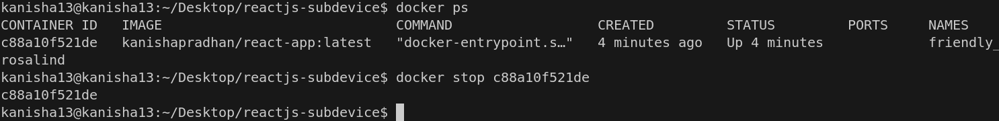

2. Implementing Docker Compose

A docker-compose.yml file was created to simplify container management.

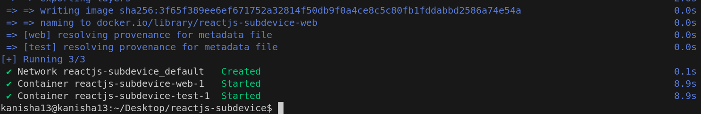

To verify that the app is running. Open your web browser -> http://localhost:3000.

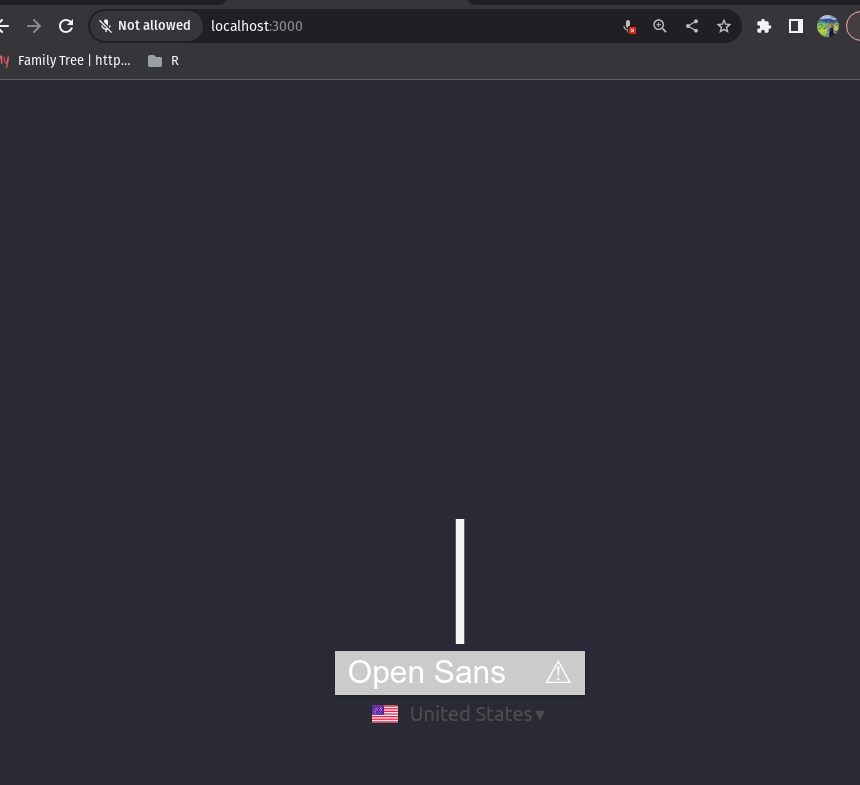

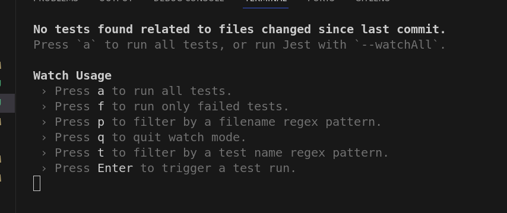


Stop the container 

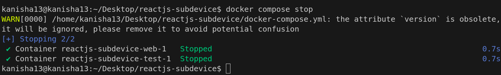

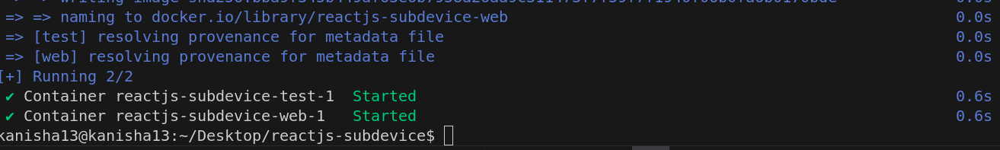

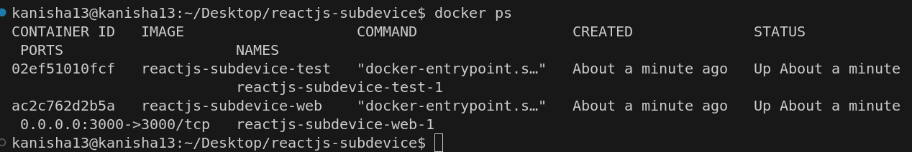

Move your test dockerfile out of root directory

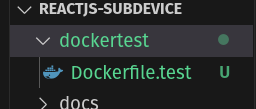

Then we docker build and get the Image ID.

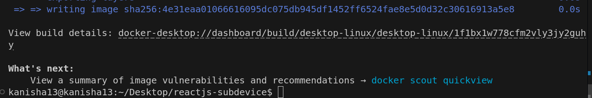


3. Multi-Stage Build Process

A production-ready Dockerfile was created with a multi-stage build process:

The production container was built and run using:

```docker build .```

```docker run -d -p 80:80 <image-id>```

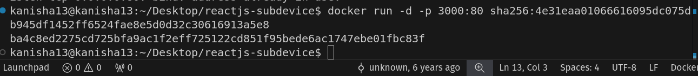

check whether the container is up

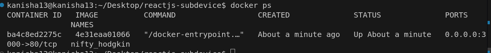

Since we used an alternative port mapping to access the application we can go to localhost:3000

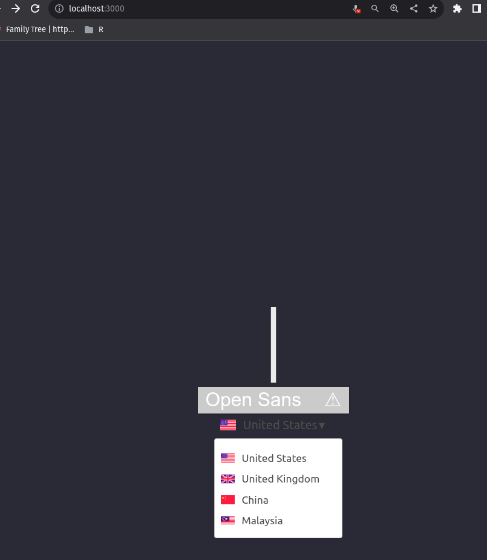

## Challenges and Solutions

#### Node.js Versioning Issues:

- Challenge: The application faced compatibility issues with newer Node.js versions.
- Solution: Using a specific older version (node:14-alpine) resolved these issues.


#### Port Conflicts:

- Challenge: Port 80 was already in use on the host machine.
- Solution: Using an alternative port mapping (e.g., 3000:80) avoided conflicts.


#### Docker Build Errors:

- Challenge: Build errors related to npm packages and dependencies.
- Solution: Using the --legacy-peer-deps flag with npm install addressed dependency resolution issues.


## Conclusion

This practical demonstrated the complete process of containerizing a React application using Docker, from development to production environments. The implementation covered key concepts including:

- Basic Docker containerization
- Volume mounting for development
- Docker Compose for service orchestration
- Multi-stage builds for optimized production containers
- Testing services in isolation

These skills form the foundation of modern CI/CD practices, enabling more efficient development workflows and consistent deployment environments.