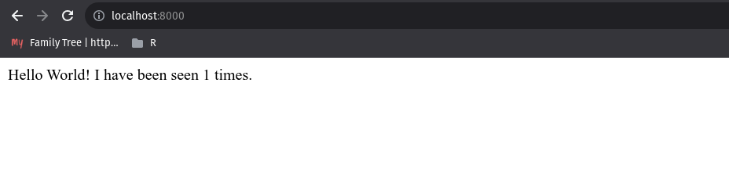
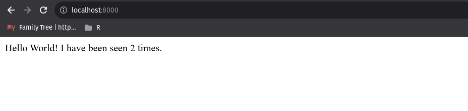
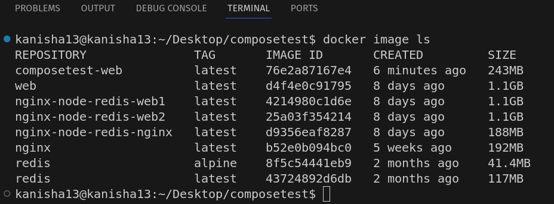
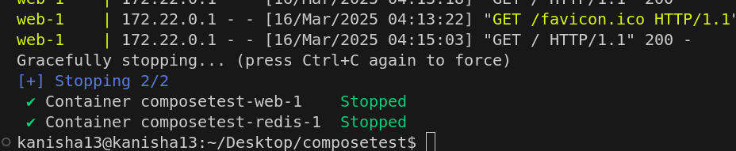
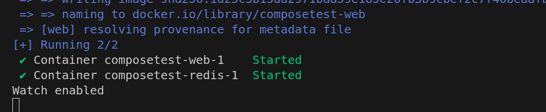
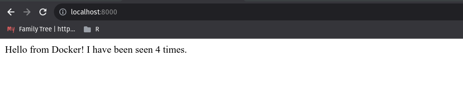
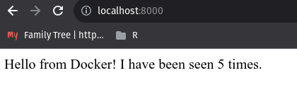
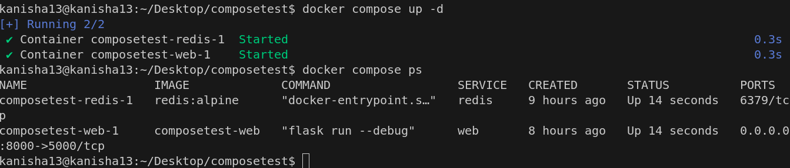
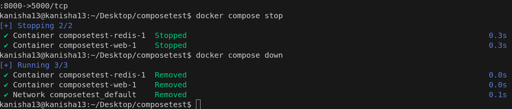

# Docker Compose Implementation Guide

## Introduction

The implementation creates a Python Flask application with Redis for counting page views, demonstrating how Docker Compose manages multi-container applications.

### Build and run the app with Compose



- refresh the page







### Re-build and run the app with Watch Compose





### split up the services using multiple Compose files

- infra.yaml
- compose.yaml



### Experiment with some other command

``` docker compose up -d ```



``` docker compose stop/ down ```


