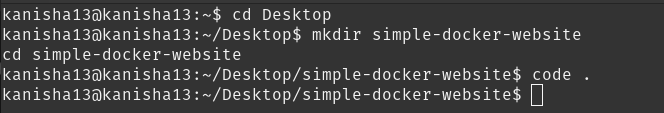
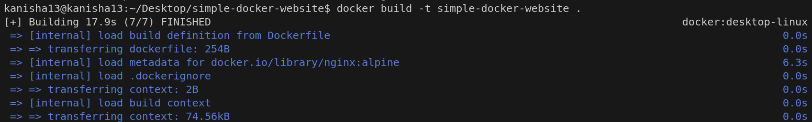
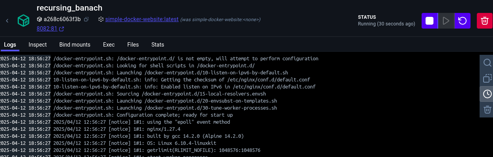
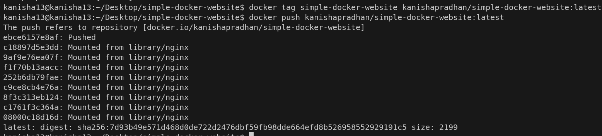
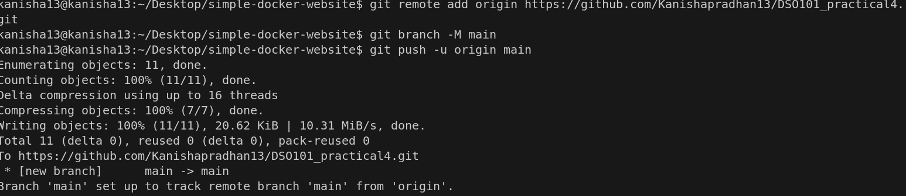
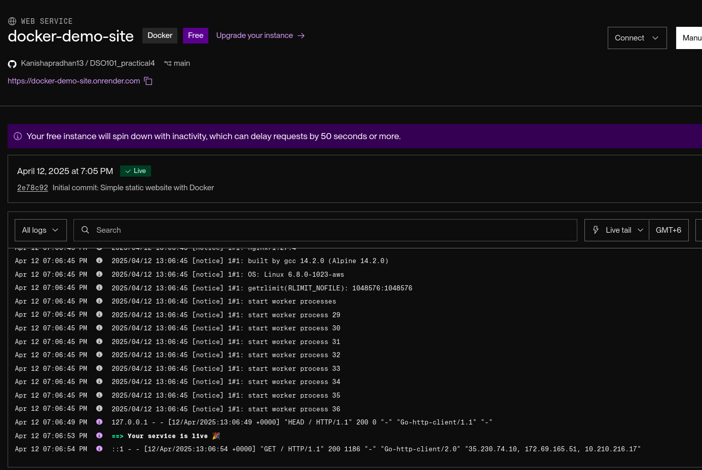
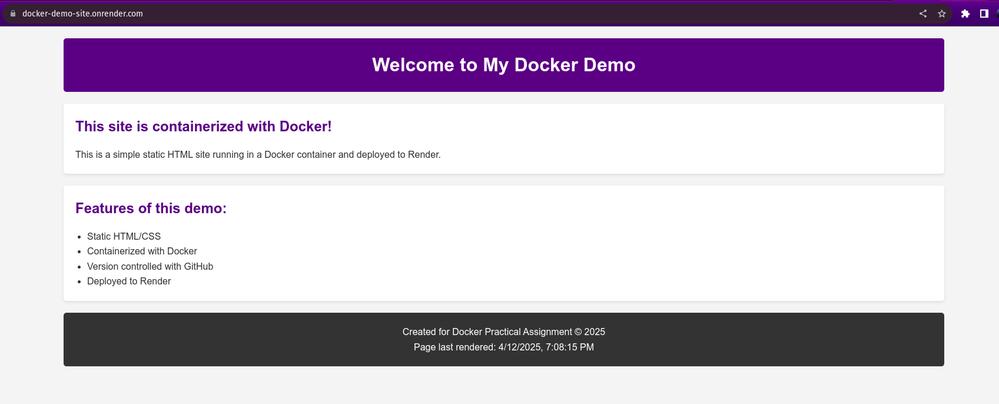

# Containerization of a Static Website using Docker with Deployment to Render

## Objectives

1. Create a Docker image for a static website and publish it to DockerHub

2. Deploy a containerized web application to Render via GitHub

## Expected Outcomes

- A functioning Docker image containing a static HTML website published on DockerHub
- A GitHub repository with proper project structure including HTML, CSS, and JavaScript files
- A live website deployed on Render.com using the Docker container
- Understanding of the complete workflow from development to deployment using containers
- Practical experience with containerization technologies used in modern web development

## Steps

#### Task 1: Create and Push Docker Image to DockerHub

- Create project directory and develop a simple static HTML website

- Create a Dockerfile using nginx as the base image
- Build the Docker image locally and test it

- Tag and push the image for DockerHub

#### Task 2: Deploy to Render via GitHub

- Push your local repository to GitHub

- Deploy the application and verify it's working

- URL of the deployed application

https://docker-demo-site.onrender.com

