# Practical 4: Jenkins Server for a git repository

# Jenkins CI/CD Pipeline for Node.js Application

## Objective

The primary objective of this project was to implement a complete Continuous Integration and Continuous Deployment (CI/CD) pipeline using Jenkins for a Node.js application. This practical exercise aimed to:

- Set up a Jenkins server with proper configuration
- Create a Node.js application with automated testing
- Implement a Jenkins pipeline that automatically builds, tests, and deploys code changes

## Steps Involved

1. Installed required plugins

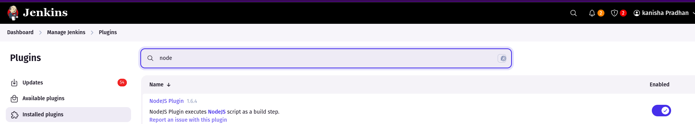

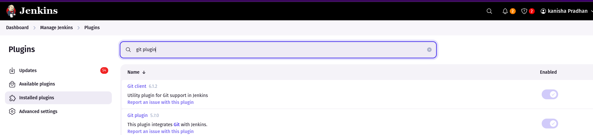

2. Node.js Tool Configuration

Configured Node.js in Jenkins Global Tool Configuration

Set up NodeJS 24.0.2 as the default version

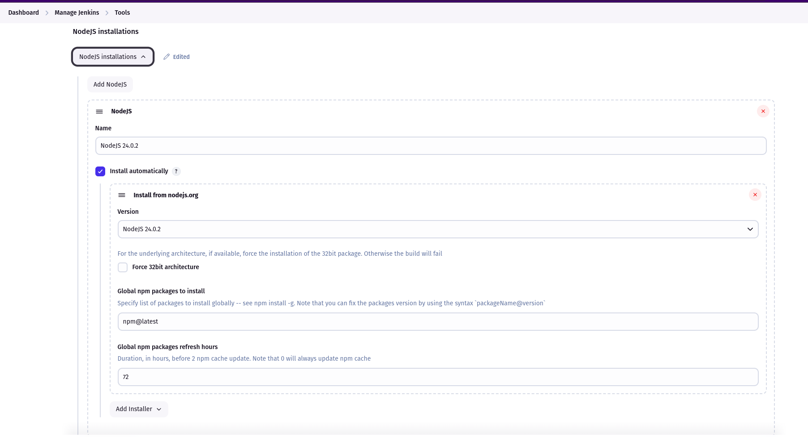

3. Created Node.js Application 

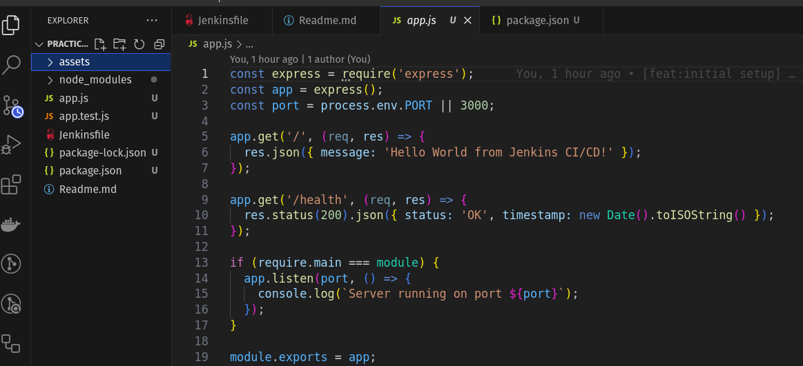

4. Created Jenkins Pipeline Job

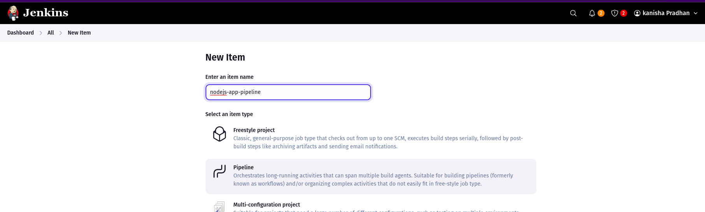

Configured SCM integration with GitHub

Defined pipeline script from SCM

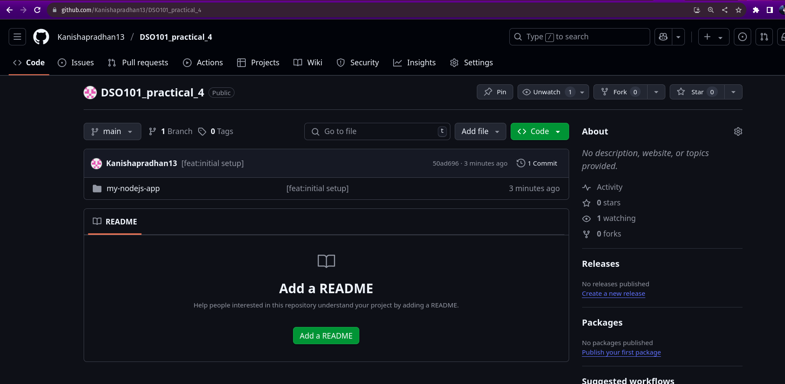

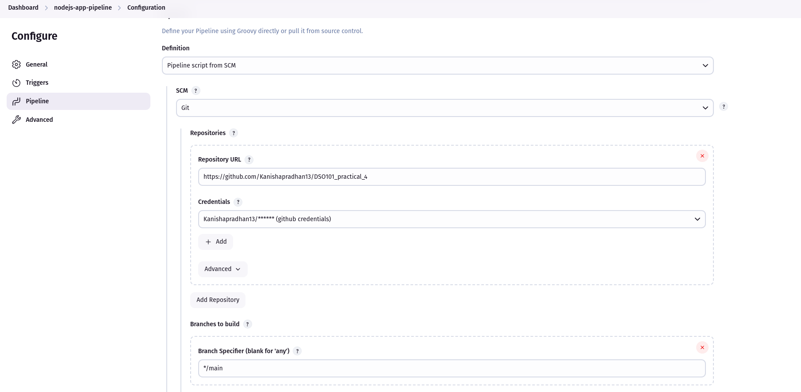

5. Implemented Multi-Stage Pipeline : Jenkinsfile

Checkout: Code retrieval from Git repository

Install Dependencies: npm package installation

Run Tests: Automated testing with coverage reports

Build: Application build process

Archive Artifacts: Store build outputs

Deploy: Staging deployment simulation

6. Run pipeline in jenkins

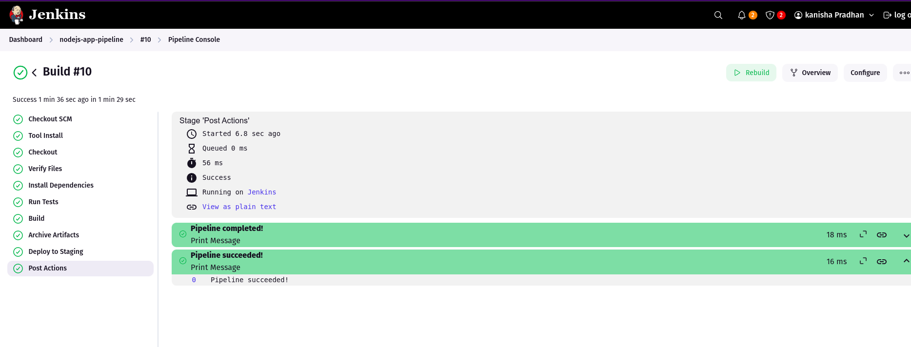

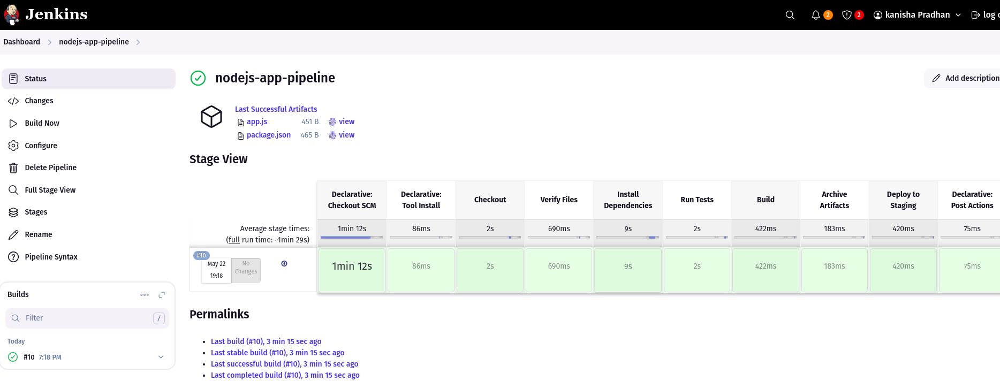

##  Challenges Faced

1. Package.json File Access Issues

Problem: Jenkins couldn't read the package.json file, resulting in ENOENT: no such file or directory errors during npm install.

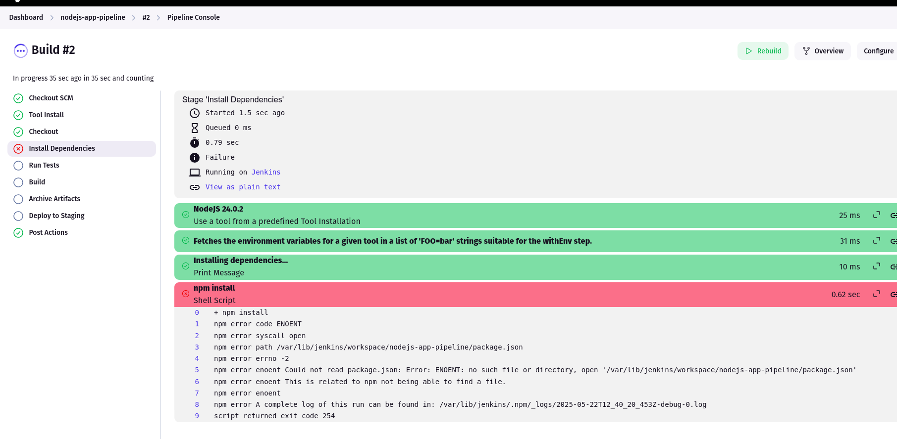

Solution:

Placed the package.json on the root of the directory since jenkinsfile was there as well.

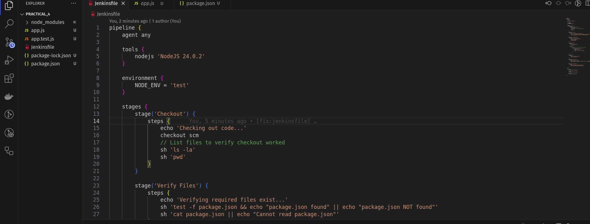

2. Node.js Tool Configuration Mismatch

Problem: Pipeline failed with "NodeJS tool not found" errors.

Root Cause: Mismatch between Jenkinsfile tool reference and Global Tool Configuration name.

Solution:

Updated Jenkinsfile to match the configured tool name (NodeJS 24.0.2)

## Conclusion

This project successfully demonstrated the implementation of a complete CI/CD pipeline using Jenkins for a Node.js application. The pipeline automates the entire software delivery process from code commit to deployment, ensuring consistent and reliable releases.

