# Practical 7: Jenkins Shared Library for Node.js Applications

## Objective

The objective of this practical exercise was to create a reusable Jenkins Shared Library that centralizes common pipeline logic for Node.js applications. The shared library includes steps for installing dependencies, running tests, building Docker images, and pushing to DockerHub. This approach promotes consistent builds, reduces copy-paste errors, and simplifies maintenance across multiple projects.

## Steps Involved 

### 1. Create the Shared Library Repository Structure

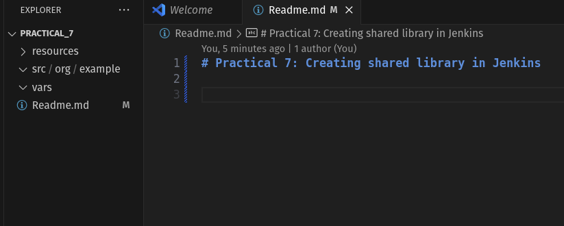

### 2. Create Shared Library Files

### 3. Create Example Node.js Application

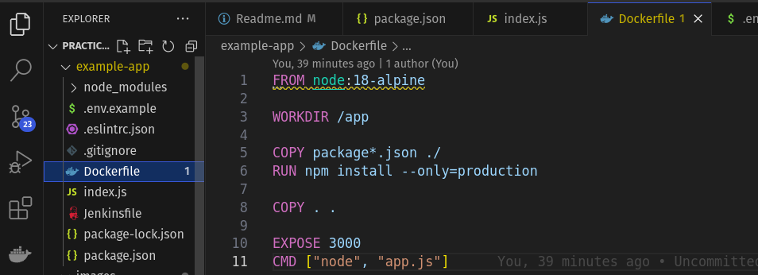

Example Jenkinsfile

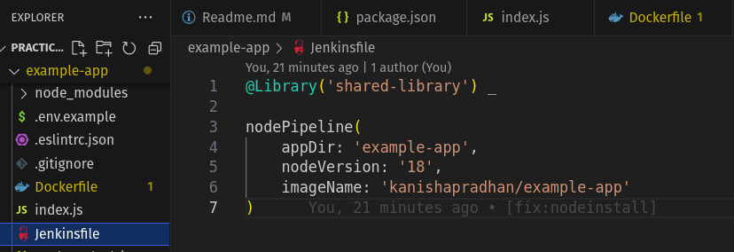

### 4. Configure Jenkins

Navigate to "Manage Jenkins" > "Configure System"

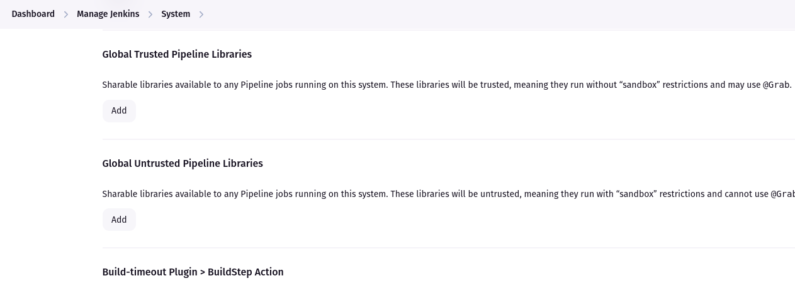

Add a new Global Pipeline Library:

Name: shared-library

Default version: main

Retrieval method: "Modern SCM" > "Git"

Project repository URL: Your Git repository URL

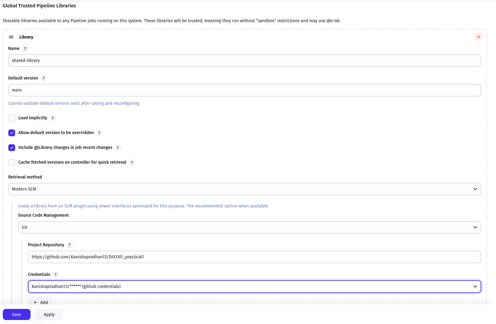

### 5. Create Jenkins Pipeline Job

Create a new Pipeline job in Jenkins

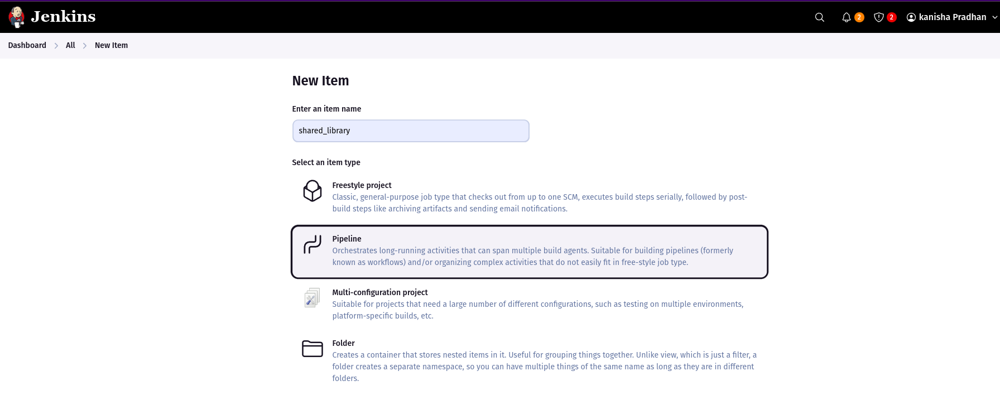

Configure source code management to pull from your application repository

Set the Jenkinsfile path

Path set as example-app/Jenkinsfile

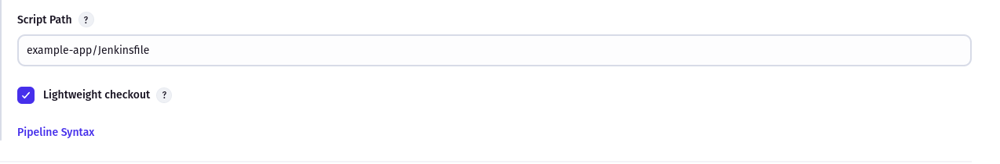

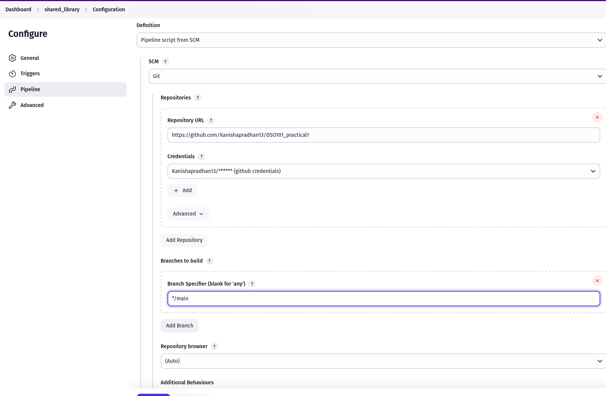

Run the pipeline

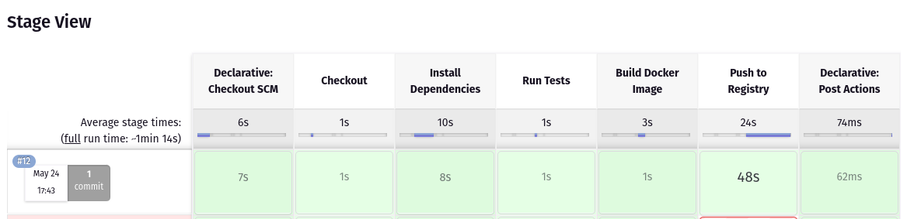

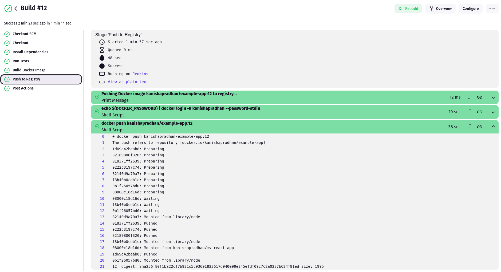

Image pushed in dockerhub

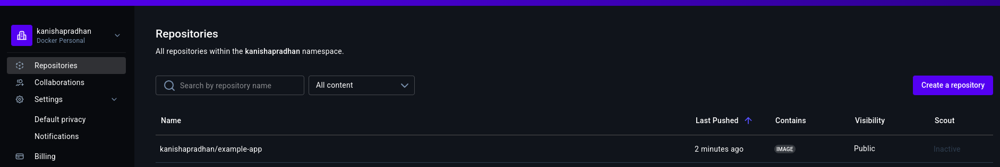

## Challenges Faced and Solutions

#### Challenge 1: unable to find jenkinsfile

Problem: jenkins wasn't able to locate the Jenkinsfile in the repository

root cause: Jenkinsfile wasn't in the root of the repo, it was in a folder called example-app 

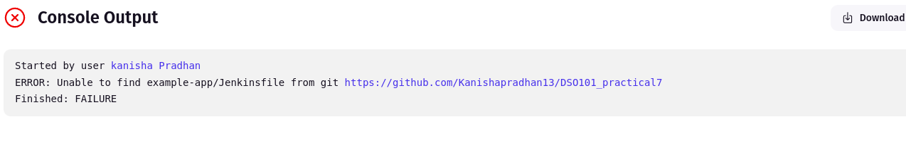

Solution: Path set as example-app/Jenkinsfile

#### Challenge 2: Package.json Not Found

Problem: The build failed with the error message: "package.json not found in the workspace."

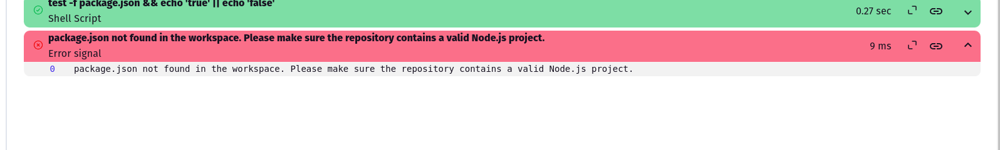

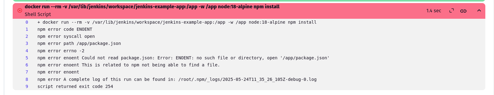

Solution: The Node.js application was in a subdirectory (example-app), but the Docker volume mount was pointing to the root workspace.

Updated All Shared Library Functions: to support a configurable app directory

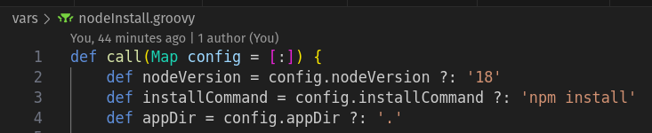

#### Challenge 3: npm ci Command Failure

Problem: npm ci failed with "can only install with an existing package-lock.json"

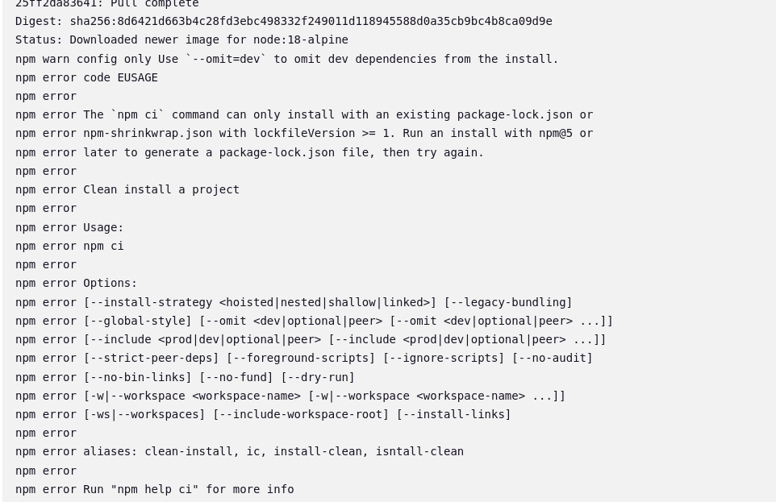

Solution:

Generated package-lock.json locally using npm install

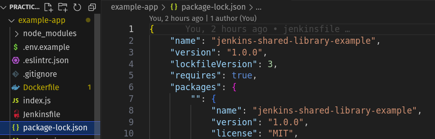

Committed and pushed the file to repository

#### Challenge 4: Library Not Found Error

Problem: Jenkins couldn't find the shared library with error "Could not find any definition of libraries [node-shared-library]"

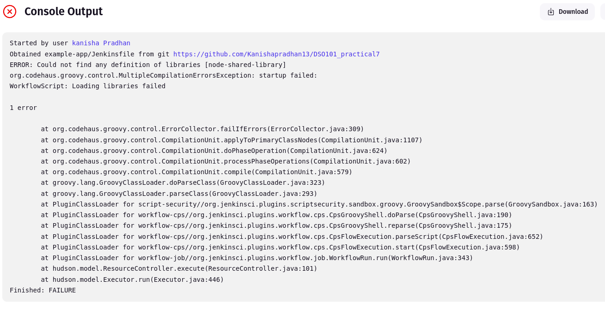

Solution:

Ensured the library name in @Library annotation matched the configured name

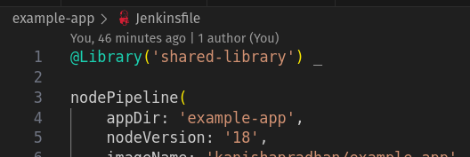

#### Challenge 5: Groovy Syntax Errors

Problem: Syntax errors in shared library Groovy files

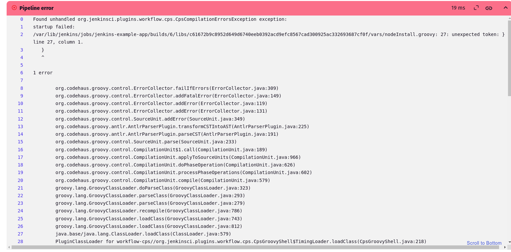

Solution:

Fixed incomplete code blocks and mismatched braces

#### Challenge 6 : push to registry Error 

Problem : The dockerhub credentials ID could not be found as it had a different ID in Jenkins.

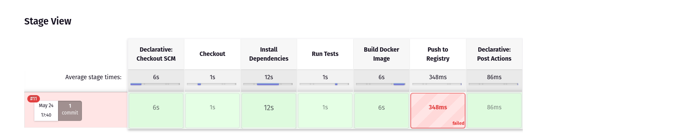

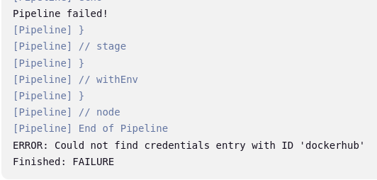

Solution: corrected the ID in nodepipeline.groovy 

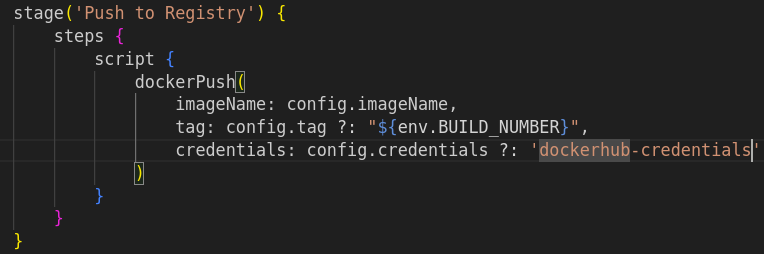

## Learning Outcomes

- Shared Library Architecture: Understood how Jenkins shared libraries are structured with vars/, src/, and resources/ directories

- Pipeline as Code: Learned to write reusable pipeline components that can be shared across projects

- Groovy Scripting: Gained experience writing Groovy functions and classes for Jenkins automation

- Docker Integration: Implemented Docker-based build and deployment stages in Jenkins pipelines

- Error Handling: Learned to debug Jenkins pipeline issues using console output and error messages

- Version Control: Understood the importance of committing all necessary files (like package-lock.json/package.json) for CI/CD

- Jenkins Configuration: Learned to configure global shared libraries and credentials in Jenkins

## Conclusion

This practical successfully demonstrated the creation and implementation of a Jenkins shared library for Node.js projects. The shared library approach significantly improves code reusability and maintenance in CI/CD pipelines.

The shared library can now be used across multiple projects, ensuring consistent build processes, reducing duplication, and making pipeline maintenance much easier. This practical provides hands-on experience with advanced Jenkins concepts that are directly applicable in real-world DevOps scenarios.