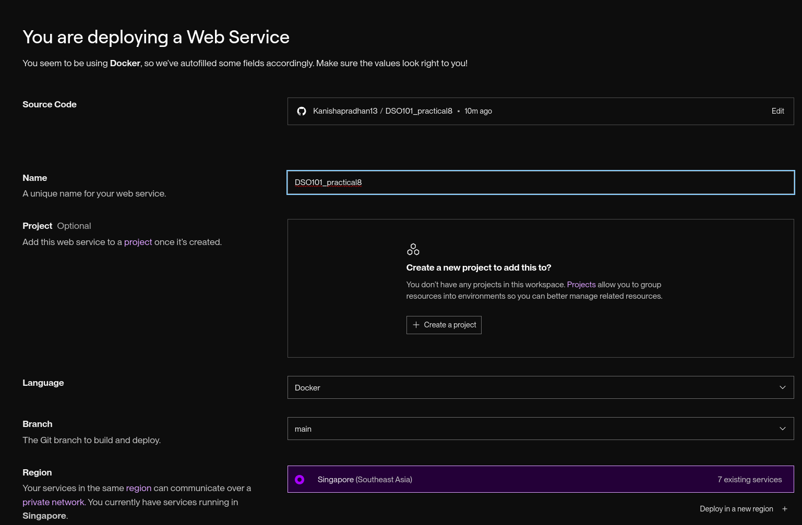

# Practicals 8: Implement a complete CICD workflow using Github actions and deploy your application. 

## Objective

The primary objective of this project was to implement a comprehensive CI/CD pipeline that automates the entire software development lifecycle from code commit to production deployment. This includes:

- Automated Testing: Ensure code quality through automated testing on every commit
- Containerization: Package the application using Docker for consistent deployment across environments
- Continuous Integration: Automatically build and test code changes
- Continuous Deployment: Automatically deploy successful builds to production
- Infrastructure as Code: Define deployment infrastructure through configuration files
- Security Best Practices: Implement secure deployment practices with proper secret management

##  Steps Involved

### Phase 1: Application Development

- Project Setup

Created a new GitHub repository

Initialized Node.js project with Express.js framework

Implemented static web application with health check endpoints

### Phase 2: Containerization

- Docker Implementation

Created optimized Dockerfile with multi-stage considerations

Implemented security best practices (non-root user)

Added health checks and proper port configuration

Created .dockerignore for optimized build context

### Phase 3: CI/CD Pipeline Setup

- GitHub Actions Configuration

Designed multi-stage pipeline (Test → Build → Deploy)

Implemented automated testing on pull requests and pushes

Set up Docker image building and pushing to Docker Hub

Configured automatic deployment to Render.com

- Secret Management

Configured GitHub Secrets for sensitive data

Set up Docker Hub authentication

Configured Render.com API integration

### Phase 4: Platform Integration

- Render.com Deployment

Configured web service on Render.com

Set up automatic deployments from Docker images

Implemented environment-specific configurations

### Phase 5: Testing and Validation

Image pushed to dockerhub

Deployed to render again on push 

## Challenges Faced

1. NPM Package Lock Issues

Challenge: Initial Docker builds were failing due to npm ci command errors related to missing or inconsistent package-lock.json files.

Root Cause: The npm ci command requires an exact package-lock.json file and fails if there are any inconsistencies.

Solution:

Generated a consistent package-lock.json locally with 'npm i'

## Learning Outcomes

1. CI/CD Pipeline Design

Learned to design efficient multi-stage pipelines

Understanding of pipeline dependencies and conditional execution

Mastered GitHub Actions workflow syntax and best practices

2. DevOps Best Practices

Implementation of Infrastructure as Code principles

Security-first approach to credential management

Automated testing and quality assurance integration

3.  Continuous Deployment Advantages

Reduced time to market for features

Minimized deployment risks through automation

Improved reliability and consistency

## Conclusion

The successful implementation of this CI/CD pipeline project has provided invaluable experience in modern software development practices. The project demonstrates the power of automation in software delivery, showcasing how proper DevOps practices can significantly improve development efficiency, code quality, and deployment reliability.

