# Practicals 5 and 6: Declarative pipeline for Jenkins and using external services

## Objective

The objective of this project is to implement a complete CI/CD pipeline using Jenkins Declarative Pipeline for a React application. The pipeline includes automated testing, building, Docker containerization, and deployment to demonstrate modern DevOps practices.

## Step-by-Step Implementation

### Phase 1: React Application Setup

1. Create React Application

2. Modified package.json scripts for CI/CD compatibility

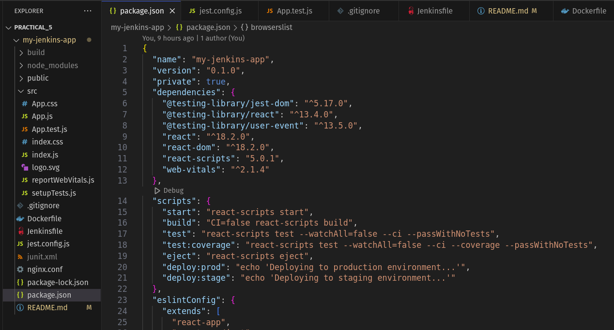

### Phase 2: Jenkins Configuration

1. Install Required Plugins

Already installed all plugins from previous assignment.

2. Configure Global Tools

Set up Node.js 24.0.2 in Global Tool Configuration

Named installation as "NodeJS 24.0.2" for pipeline reference

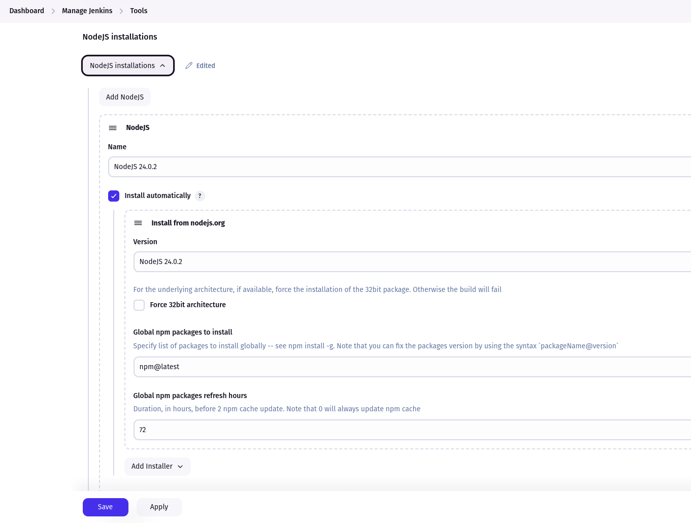

3. Create Pipeline Job

New Item → Pipeline

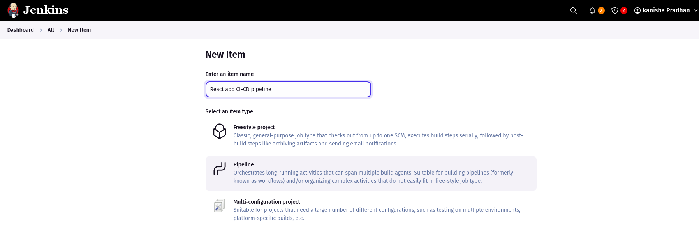

Configure SCM: Git repository URL

Set Script Path: Jenkinsfile

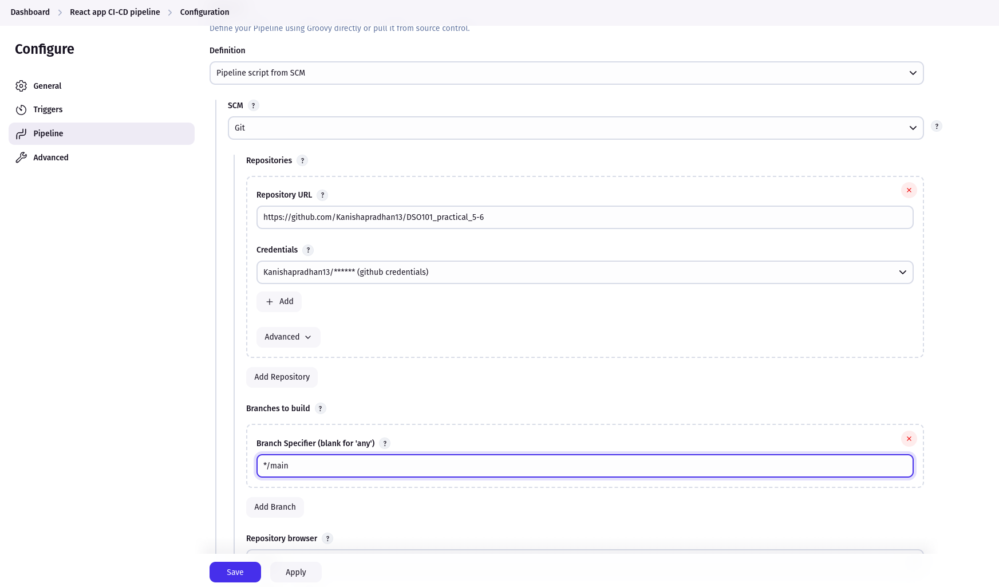

### Phase 3: Jenkinsfile Creation

1. Basic Pipeline Structure

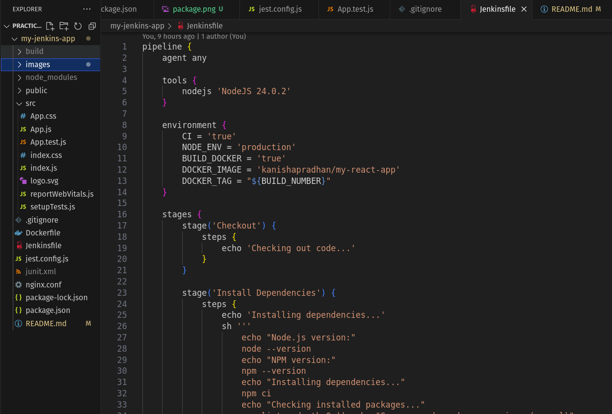

2. Pipeline Stages Implemented

Checkout: Code retrieval and branch information

Install Dependencies: npm ci with error handling

Test: Automated testing with junit reporting

Build Application: React production build

Build Docker Image: Multi-stage Docker build

Push to Docker Hub: Secure image publishing

Clean Docker Images: Resource cleanup

Deploy: Environment-specific deployment

3. run pipeline in jenkins 

successful after 4 attempts

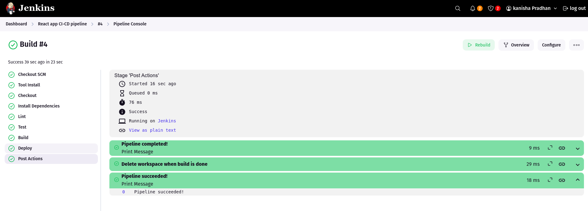

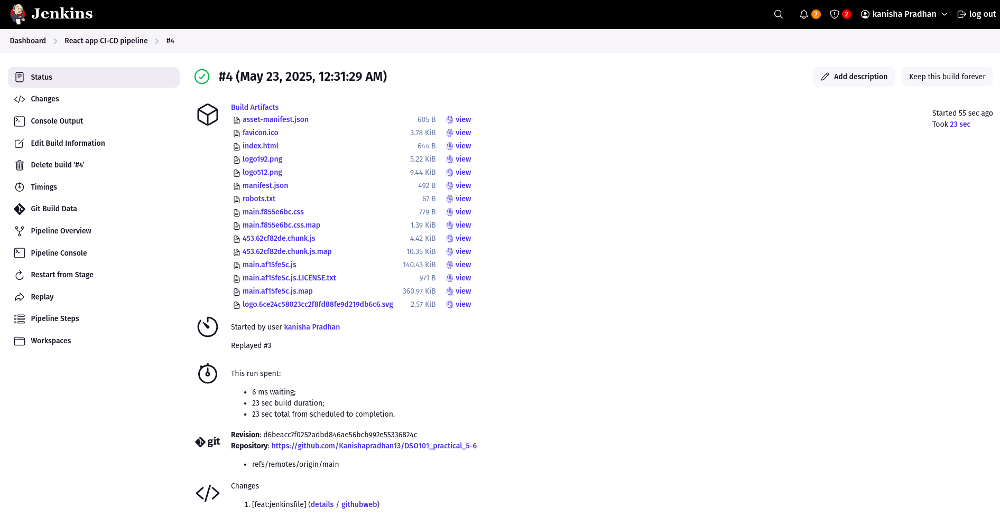

### Phase 4: Docker Integration (Part 2: Challenge)

1. Create Dockerfile

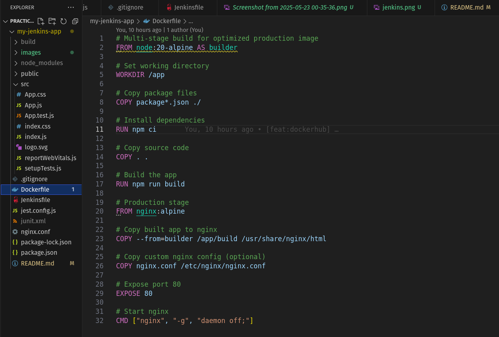

2. Configure Docker Hub Credentials

Added credentials in Jenkins credential store

Used secure credential references in pipeline

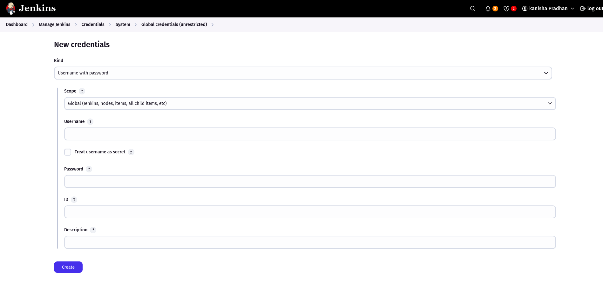

3. Test build locally 

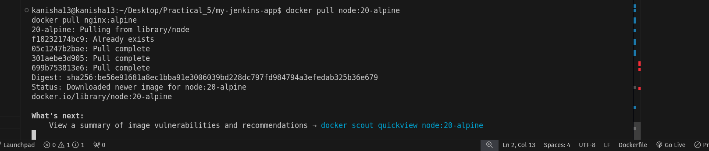

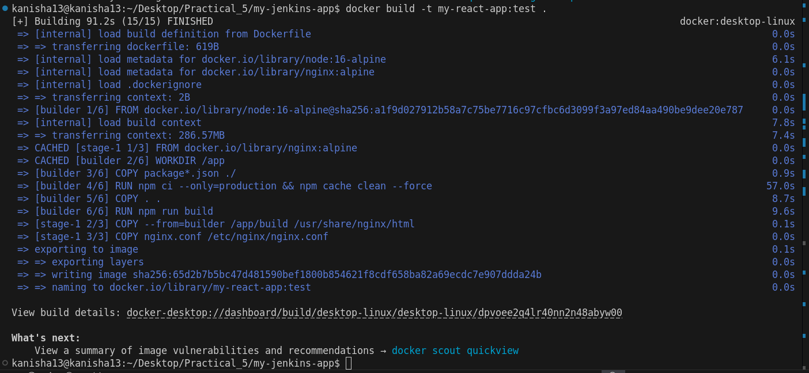

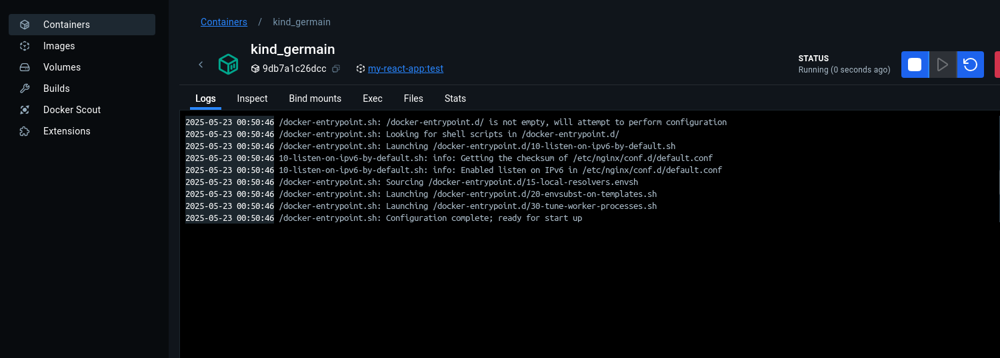

4. Run pipeline in jenkins.

successful after 13 attempts.

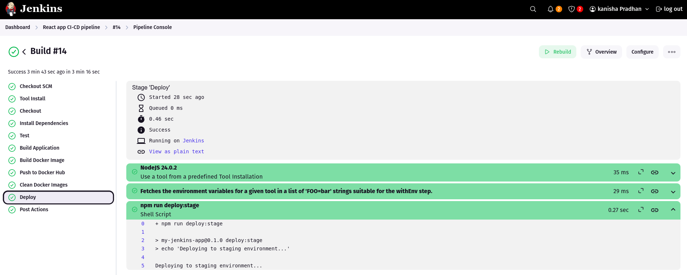

images in dockehub

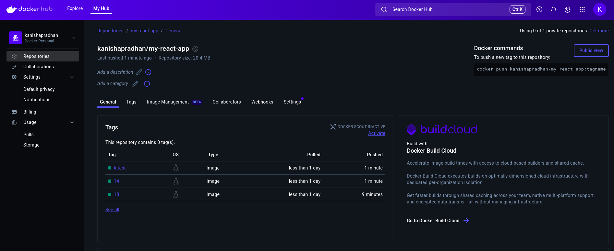


##  Challenges Faced

1. Jest-junit Test Reporter Not Found

Issue: Pipeline failed with error Module jest-junit in the testResultsProcessor option was not found

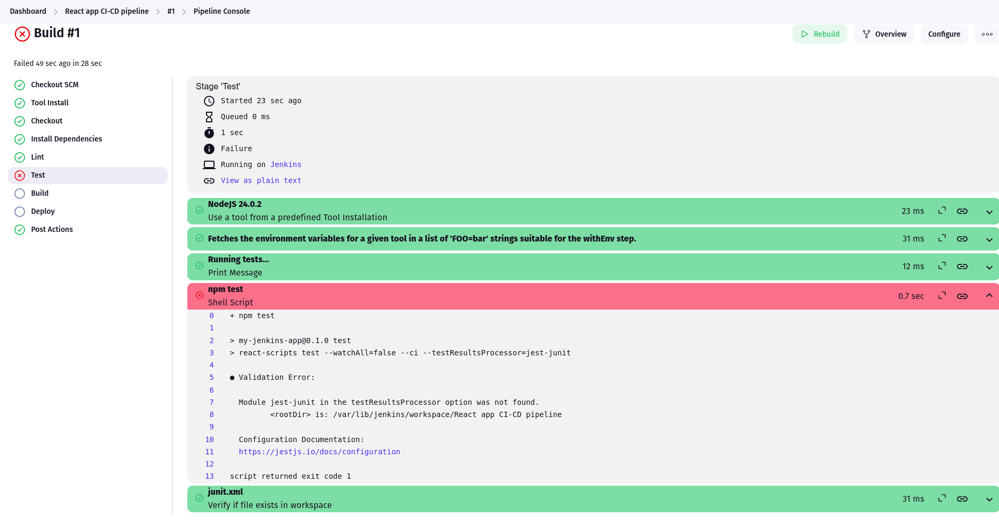

solution: 

used this simpler approach and Updated package.json scripts to remove jest-junit dependency

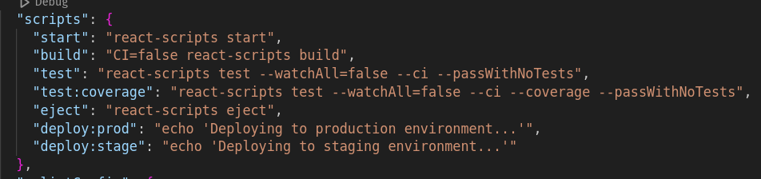

also updated the Jenkinsfile to skip junit reporting

```stage('Test') {
            steps {
                echo 'Running tests...'
                sh '''
                    echo "Running React tests..."
                    npm test
                    echo "Tests completed successfully"
                '''
            }
        }
```

2. Node.js Version Mismatch

Issue: Build warnings about unsupported engine versions (Node.js 16 vs required 18+)

Root Cause: Dockerfile was using node:16-alpine while dependencies required Node.js 18+.

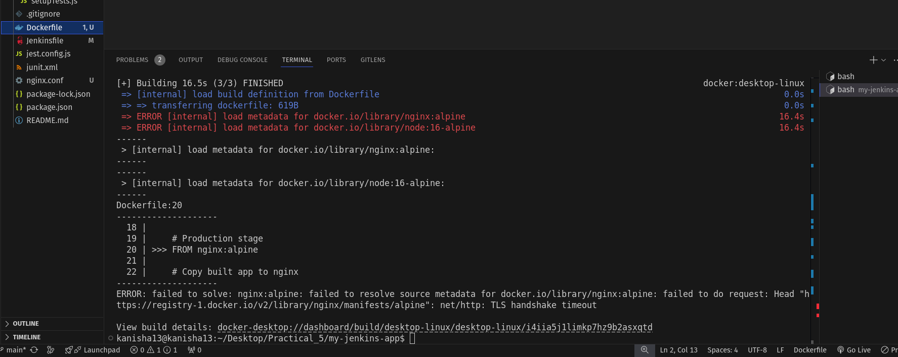

Solution:

Updated Dockerfile to use node:20-alpine for consistency

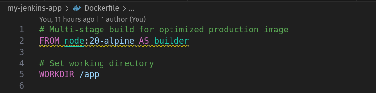

3. Build docker image , installing dependencies 

Issue: RUN npm ci --only=production && npm cache clean --force

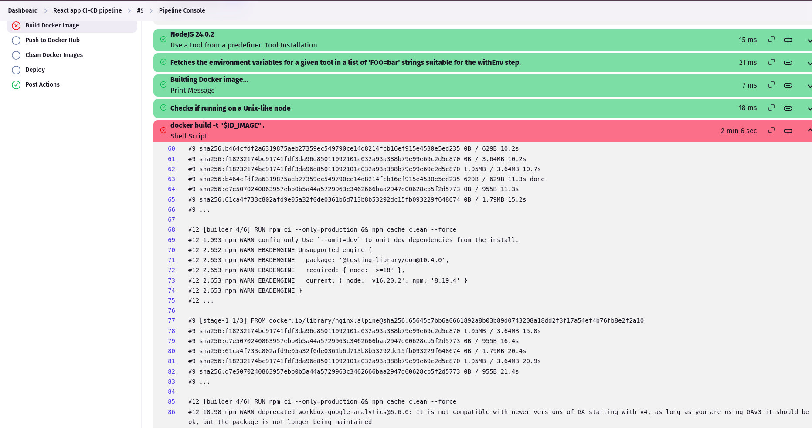

solution :

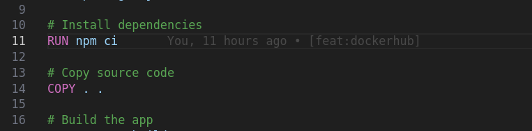

4. Docker Build,Push and deploy Stages Being Skipped

Issue: Pipeline showed "Skipping stage due to when conditional" for Docker-related stages

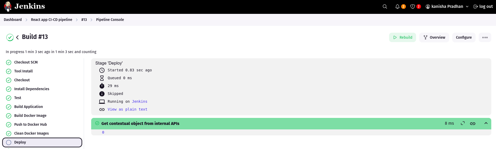

Root Cause: Jenkins pipeline had when conditions that only allowed Docker stages to run on main branch or with specific environment variables.

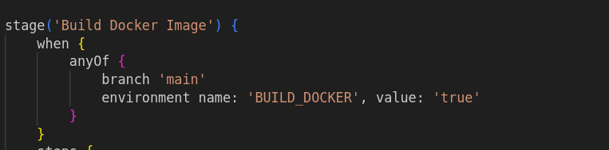

Solution: 

Added environment variable BUILD_DOCKER=true to enable Docker operations

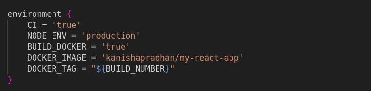

for deploy stage , removed the when conditions. 

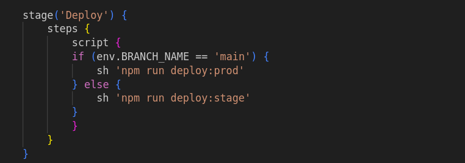

##  Learning Outcomes

1. Jenkins Pipeline Development

Mastered Declarative Pipeline syntax

Learned stage organization and flow control

Implemented error handling and conditional execution


2. Docker Containerization

Created multi-stage Docker builds for optimization

Learned Docker networking in CI/CD environments

Implemented secure image publishing workflows


3. CI/CD Best Practices

Automated testing integration

Environment-specific deployment strategies

Security credential management

##  Conclusion

This project successfully demonstrates the implementation of a complete CI/CD pipeline using Jenkins for a React application. The pipeline automates the entire software delivery process from code commit to production deployment, incorporating modern DevOps practices .


